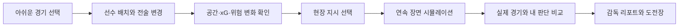

# 되감독90

> 그 경기를 되감고, 내가 감독이 된다.

월드컵의 결정적 순간으로 돌아가 선수 배치, 포메이션, 교체, 전술 강도와 현장 지시를 직접 바꾸고, 그 판단이 **공간 → xG → 장면 → 스코어**에 만든 변화를 확인하는 인과형 전술 시뮬레이터입니다.

[](https://react.dev/)
[](https://vite.dev/)
[](#검증)
[](LICENSE)


## 왜 되감독90인가

기존 전술판은 배치를 보여주지만, 그 선택이 경기에 어떤 차이를 만들었는지는 설명하지 못합니다. 되감독90은 실제 경기 사실을 출발점으로 두고 사용자의 판단을 같은 조건에서 다시 시뮬레이션합니다.

- **6개의 감독석**: 한국-가나, 한국-포르투갈, 아르헨티나-프랑스, 벨기에-일본, 브라질-크로아티아, 일본-벨기에
- **직접 조작**: 드래그 배치, 포메이션, 교체, 템포, 폭, 압박, 위험도
- **즉시 피드백**: 선택 직후 공간 활용도, xG, 실점 위험과 전술 설명 갱신
- **연속 리플레이**: 공과 22명의 움직임, 슈팅 궤적, 골라인 판정을 하나의 장면으로 재생
- **설명 가능한 결과**: 실제 경기, 기존 전술, 내 선택, 코치 제안을 한 화면에서 비교
- **60초 첫 플레이**: 회원가입, 결제, API 키 없이 브라우저에서 바로 시작

## 핵심 흐름



## 빠른 시작

필요 환경: Node.js 20 이상, npm 10 이상

```bash
cd app
npm ci
npm run dev
```

기본 개발 주소는 `http://localhost:5173`입니다.

```bash
cd app
npm test
npm run build
npm run preview
```

## Vercel 배포

저장소 루트의 [`vercel.json`](vercel.json)에 모노레포 빌드 설정이 포함되어 있습니다.

1. Vercel에서 이 GitHub 저장소를 Import합니다.
2. Root Directory는 저장소 루트(`.`)를 유지합니다.
3. 별도 환경 변수 없이 Deploy를 실행합니다.

Vercel은 `npm --prefix app ci`, `npm --prefix app run build`, `app/dist` 설정을 사용합니다. 배포 후 실제 URL은 이 README 상단에 추가합니다.

## 시연 영상

[`video/`](video/)에는 1920×1080, 30fps, 약 90초 분량의 Remotion 시연영상 소스가 있습니다. 외부 경기 영상이나 상업 음원을 사용하지 않고, 앱 화면과 자체 합성 관중음만 사용합니다.

```bash
cd video
npm ci
npm run studio
npm run render
```

렌더 결과는 `output/video/doegamdok90-demo.mp4`에 생성됩니다. 영상 구성과 YouTube 업로드 문안은 [`video/README.md`](video/README.md)를 참고하세요.

## 프로젝트 구조

```text
.
├─ app/                 # React/Vite 웹 애플리케이션
│  ├─ src/components/  # 전술판, 시뮬레이션, 리포트 UI
│  ├─ src/engine/      # 규칙, 점수, 시뮬레이션 엔진
│  ├─ src/data/        # 경기 시나리오와 로스터
│  └─ test/            # Node 기반 자동 테스트
├─ data/                # 초기 데이터 모델 샘플
├─ docs/                # PRD, 기능명세, 유저플로우, 감사 기록
├─ video/               # Remotion 시연영상 프로젝트
├─ output/pdf/          # 제출용 기획서 PDF
└─ vercel.json          # Vercel 빌드 설정
```

## 기술 구조

- **UI**: React 19, Vite 6, Phosphor Icons
- **조작**: `@dnd-kit/core` 기반 선수 드래그
- **시뮬레이션**: 시드 기반 결정론적 로컬 모델
- **상태 보존**: 브라우저 로컬 저장
- **배포**: 정적 Vite 빌드, 런타임 API 및 비밀키 없음
- **영상**: Remotion 기반 재현 가능한 MP4 렌더링

## 검증

`npm test`는 6개 경기 로스터, 포메이션과 드래그, 교체 규칙, 전술 점수와 xG, 현장 지시, 연속 보간, 골라인 판정, 매치 플랜, 감독 리포트, 초상 권리 게이트와 브랜드 일관성을 포함한 26개 자동 테스트를 실행합니다.

주요 UX와 브라우저 플레이테스트 기록은 [`app/audit/`](app/audit/)의 Markdown 보고서에 남겨 두었습니다.

## 데이터와 권리

되감독90은 **비공식·비상업 팬 시뮬레이션**이며 FIFA, DAKER, 국가대표팀, 선수, 방송사와 제휴·후원 관계가 없습니다.

- 대회, 대진, 실제 스코어와 주요 시점은 연결된 공식 경기 기록을 참고한 사실 정보입니다.
- 선수 능력치, xG, 전술 점수, 감독 점수와 시뮬레이션 결과는 체험을 위한 자체 모델 값이며 공식 통계나 예측이 아닙니다.
- 실제 선수 사진, 합성 닮은꼴, 팀 엠블럼, FIFA 로고, 방송 캡처와 상업 음원을 포함하지 않습니다.
- 선수는 이름, 등번호, 포지션과 국가색 유니폼 마커로 표현합니다.
- 국기는 MIT 라이선스의 [`country-flag-icons`](https://github.com/catamphetamine/country-flag-icons)를 사용합니다.
- 경기장 이미지는 프로젝트 전용 생성 자산이며 관중음은 로컬 코드로 합성했습니다.

세부 근거는 [`NOTICE.md`](NOTICE.md)와 [`docs/14-assets-and-license.md`](docs/14-assets-and-license.md)를 확인하세요.

## 문서

- [기획서 PDF](output/pdf/되감독90_기획서_제출본.pdf)
- [PRD](docs/01-prd.md)
- [기능명세서](docs/02-functional-spec.md)
- [유저플로우](docs/03-user-flows.md)
- [와이어프레임](docs/04-wireframes.md)
- [데이터·아키텍처](docs/05-data-and-architecture.md)
- [점수·리포트 엔진](docs/09-scoring-and-report-engine.md)
- [자산·라이선스 등록부](docs/14-assets-and-license.md)
- [최종 UX·코드 감사](docs/23-final-ux-code-winning-upgrade-v17.md)

## 라이선스

애플리케이션 **소스 코드**는 [MIT License](LICENSE)로 배포합니다. 되감독90의 이름·로고, 경기 데이터 큐레이션, 생성 이미지·오디오, 기획서와 영상은 MIT 허가 범위에서 제외되며 각각의 권리·출처 조건을 따릅니다. 자세한 범위는 [NOTICE.md](NOTICE.md)에 명시되어 있습니다.

Copyright © 2026 되감독90 contributors.
