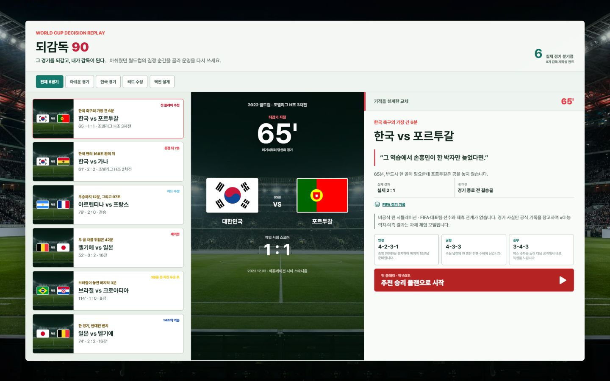
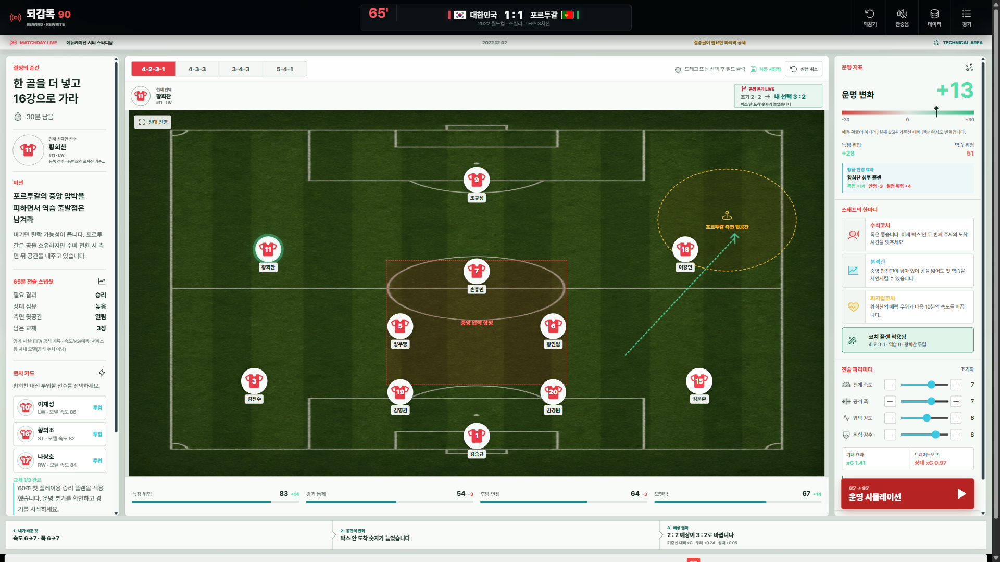
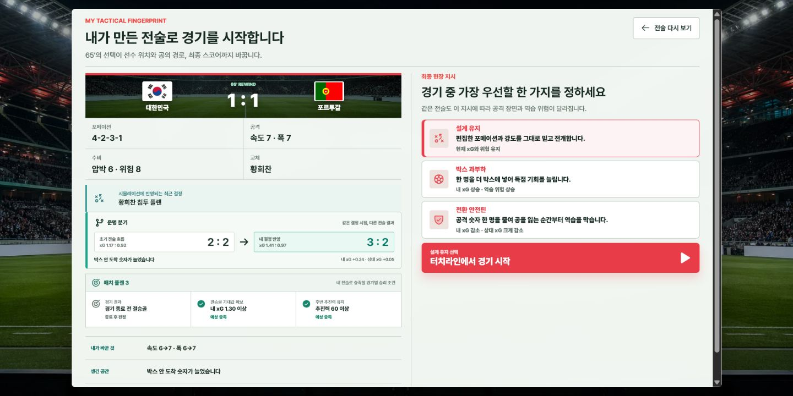
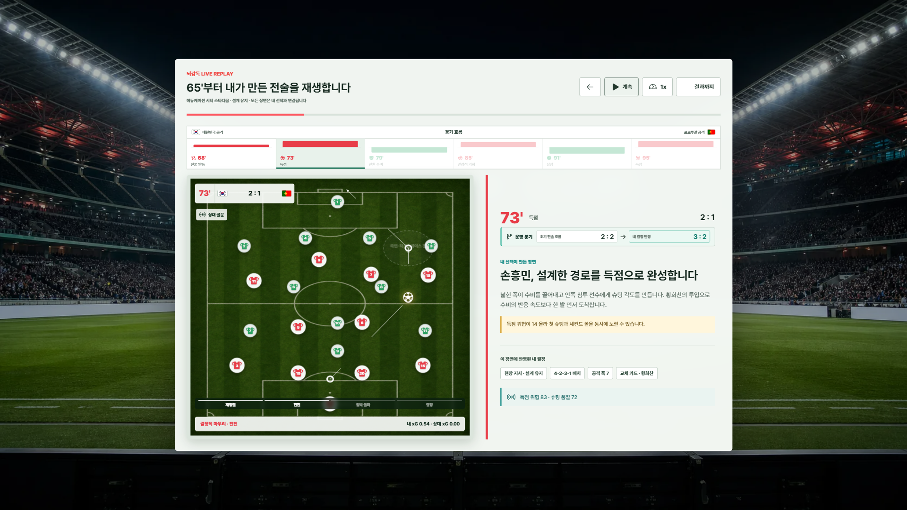
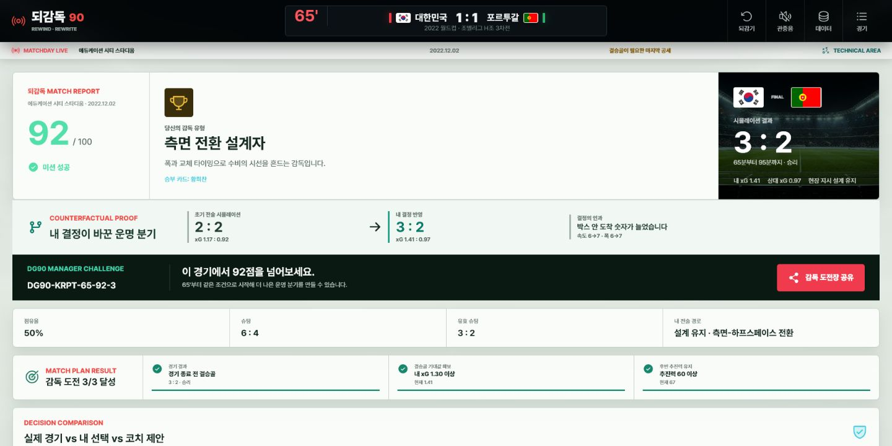
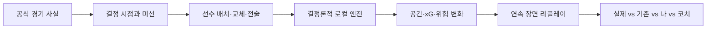

<div align="center">

# 되감독90

### 그 경기를 되감고, 내가 감독이 된다.

월드컵의 결정적 순간을 다시 지휘하고, 내 판단이 만든 변화를 끝까지 추적하는 **인과형 전술 시뮬레이터**

[](https://github.com/Lova-clover/doegamdok90/actions/workflows/ci.yml)
[](https://react.dev/)
[](https://vite.dev/)
[](#검증과-품질)
[](LICENSE)
[](https://vercel.com/new/clone?repository-url=https%3A%2F%2Fgithub.com%2FLova-clover%2Fdoegamdok90)

[대회 안내](https://daker.ai/public/hackathons/world-cup-manager-tactics-web-challenge) · [기획서 PDF](output/pdf/되감독90_기획서_제출본.pdf) · [PRD](docs/01-prd.md) · [시연영상 소스](video/) · [권리 고지](NOTICE.md)

</div>



## 한 문장으로

기존 전술판이 “어디에 놓았는가”에서 끝난다면, 되감독90은 사용자의 선택이 **공간 → xG → 장면 → 스코어**를 어떻게 바꿨는지 같은 조건에서 보여줍니다.

## 60초 심사 동선

| 시간 | 사용자의 행동 | 확인되는 가치 |
| --- | --- | --- |
| 0–10초 | 아쉬운 월드컵 경기와 결정 시점 선택 | 실제 경기 맥락에 즉시 몰입 |
| 10–25초 | 선수를 드래그하고 포메이션·교체·전술 조정 | “내가 감독이다”라는 직접 조작감 |
| 25–35초 | 공간 활용, xG, 역습 위험 변화 확인 | 선택과 결과 사이의 원인 이해 |
| 35–45초 | 압박 유지·측면 전개 등 현장 지시 선택 | 경기 중 감독의 판단 경험 |
| 45–55초 | 선수와 공이 이어지는 장면 리플레이 재생 | 전술이 실제 움직임으로 변환 |
| 55–60초 | 실제 경기·기존 전술·내 선택·코치 제안 비교 | 판단의 이유와 대가를 리포트로 확인 |

## 핵심 경험

| 기능 | 구현 내용 |
| --- | --- |
| **아쉬운 경기 보관함** | 6개의 실제 월드컵 결정 순간과 서로 다른 감독 미션 |
| **전술 직접 조작** | 드래그 배치, 역할 기반 포메이션, 교체, 템포·폭·압박·위험도 |
| **즉시 인과 피드백** | 공간 활용도, xG, 실점 위험과 자연어 설명을 선택 직후 갱신 |
| **현장 지시** | 경기 흐름에 맞춘 지시가 모멘텀·이벤트·예상 결과에 반영 |
| **연속 리플레이** | 22명과 공의 보간 이동, 슈팅 경로와 실제 골라인 판정 |
| **감독 리포트** | 실제 경기·기존 전술·내 선택·코치 제안의 동일 조건 비교 |
| **재도전 루프** | 감독 점수, 매치 플랜, 다음 경기 추천과 공유용 `DG90` 도전장 |

<table>
  <tr>
    <td width="50%"></td>
    <td width="50%"></td>
  </tr>
  <tr>
    <td align="center"><b>직접 조작하는 전술 보드</b></td>
    <td align="center"><b>공간·xG·위험도의 즉시 변화</b></td>
  </tr>
  <tr>
    <td width="50%"></td>
    <td width="50%"></td>
  </tr>
  <tr>
    <td align="center"><b>골라인까지 이어지는 리플레이</b></td>
    <td align="center"><b>실제 경기와 내 판단 비교</b></td>
  </tr>
</table>

## 플레이 가능한 감독석

- 대한민국 vs 가나 · 2022 · 61분
- 대한민국 vs 포르투갈 · 2022 · 65분
- 아르헨티나 vs 프랑스 · 2022 · 79분
- 벨기에 vs 일본 · 2018 · 52분
- 브라질 vs 크로아티아 · 2022 · 114분
- 일본 vs 벨기에 · 2018 · 74분

같은 경기라도 어느 벤치와 어느 시점에 앉느냐에 따라 문제와 승리 조건이 달라집니다.

## 동작 구조



```text
React UI
  ├─ components/  전술판 · 코치진 · 시뮬레이션 · 리포트
  ├─ data/        경기 시나리오 · 선수 · 미션 · 출처
  ├─ engine/      규칙 · 점수 · 이벤트 · 장면 생성
  └─ utils/       포메이션 · 선수 권리 · 모션 보간 · 브랜드
```

동일한 입력은 언제나 동일한 장면과 결과를 만듭니다. 외부 AI API나 확률형 서버 응답 없이 심사자가 같은 선택을 재현할 수 있습니다.

## 로컬 실행

필요 환경: Node.js 20 이상, npm 10 이상

```bash
git clone https://github.com/Lova-clover/doegamdok90.git
cd doegamdok90
npm run install:app
npm run dev
```

기본 개발 주소는 `http://localhost:5173`입니다.

```bash
npm test
npm run build
npm run preview
```

## Vercel 배포

[](https://vercel.com/new/clone?repository-url=https%3A%2F%2Fgithub.com%2FLova-clover%2Fdoegamdok90)

저장소 루트의 [`vercel.json`](vercel.json)이 다음 설정을 고정합니다.

| 항목 | 값 |
| --- | --- |
| Root Directory | `.` |
| Runtime | Node.js `20.x` |
| Install Command | `npm run install:app` |
| Build Command | `npm run build` |
| Output Directory | `app/dist` |
| 환경 변수 | 없음 |

루트 [`package.json`](package.json)과 [`vercel.json`](vercel.json)이 같은 빌드 계약을 공유합니다. 따라서 GitHub Actions, 로컬 환경, Vercel이 모두 동일한 명령을 실행하며 모노레포 경로 감지 차이로 인한 배포 실패를 줄입니다.

```bash
npm run install:app
npm test
npm run build
npx vercel build # vercel login 및 프로젝트 연결 후
```

권장 Root Directory는 저장소 루트 `.`입니다. 기존 Vercel 프로젝트가 `app`으로 고정돼 있어도 [`app/vercel.json`](app/vercel.json)이 동일한 결과를 만드는 호환 설정을 제공합니다. 대시보드의 사용자 지정 명령은 제거하고 재배포하세요. 상세한 배포·실패 복구·제출 동결 절차는 [`docs/DEPLOYMENT.md`](docs/DEPLOYMENT.md)를 따릅니다.

## 시연 영상

[`video/`](video/)는 실제 앱 캡처를 사용한 1920×1080, 30fps, 88초 Remotion 프로젝트입니다.

```bash
cd video
npm ci
npm run studio
npm run render
npm run render:thumbnail
```

- H.264 영상: `output/video/doegamdok90-demo.mp4`
- YouTube 썸네일: `output/video/doegamdok90-thumbnail.png`
- 외부 경기 영상·선수 사진·방송 화면·상업 음원 없음
- 관중음은 고정 시드로 직접 합성한 프로젝트 자산

영상 타임라인과 YouTube 제목·설명문은 [`video/README.md`](video/README.md)에 포함되어 있습니다.

## 검증과 품질

- **자동 테스트 26개**: 로스터, 교체 규칙, 포메이션, 전술 점수, xG, 지시 효과, 장면 보간, 골라인 판정, 권리 게이트
- **프로덕션 빌드 통과**: Vite 정적 번들
- **의존성 감사 통과**: 앱·영상 프로젝트 `npm audit` 0건
- **반응형 검증**: 데스크톱과 390px 모바일 전체 흐름
- **접근성 고려**: 키보드 조작, 명시적 버튼 라벨, 읽기 가능한 대비, 모션 감소 대응
- **개인정보 최소화**: 로그인·결제·쿠키 추적·서버 저장 없음
- **오프라인 결정성**: 런타임 API 키와 외부 모델 호출 없음

GitHub Actions는 모든 push와 pull request에서 테스트와 프로덕션 빌드를 다시 실행합니다.

## 데이터 투명성

| 구분 | 예시 | 처리 원칙 |
| --- | --- | --- |
| **공식 사실 레이어** | 대회, 대진, 실제 스코어, 득점 시점, 주요 교체 | 연결된 공식 경기 기록을 참고하고 출처 URL 유지 |
| **자체 체험 모델** | 선수 능력치, xG, 전술 점수, 감독 점수, 예상 스코어 | 공식 통계·예측이 아님을 화면과 문서에 명시 |

되감독90은 **비공식·비상업 팬 시뮬레이션**이며 FIFA, DAKER, 국가대표팀, 선수 또는 방송사와 제휴·후원 관계가 없습니다. 실제 선수 사진, 합성 닮은꼴, 팀 엠블럼, FIFA 로고, 방송 캡처와 상업 음원을 포함하지 않습니다.

## 라이선스와 권리 범위

| 범위 | 조건 |
| --- | --- |
| 원본 애플리케이션·테스트·Remotion 소스 | [MIT License](LICENSE) |
| `되감독90` 이름·워드마크·태그라인·`DG90` | 프로젝트 권리자 보유, 별도 허가 필요 |
| 경기 큐레이션·모델 파라미터·기획 문서 | MIT 범위 제외, 사실 정보의 독립적 권리는 제한하지 않음 |
| 생성 이미지·합성 오디오·스크린샷·영상 | MIT 범위 제외, 프로젝트 및 대회 제출 용도 |
| npm 패키지·국기 | 각 제3자 라이선스 적용 |
| DAKER 수상자 라이선스 | 참가 시 동의한 대회별 규정이 우선 |

MIT 본문은 수정하지 않았으며, 범위와 예외는 [`NOTICE.md`](NOTICE.md), 자산 근거는 [`docs/14-assets-and-license.md`](docs/14-assets-and-license.md), 외부 패키지는 [`THIRD_PARTY_NOTICES.md`](THIRD_PARTY_NOTICES.md)에 분리했습니다.

**빠른 판단 기준:** 코드를 재사용하려면 MIT 고지를 유지합니다. 브랜드·기획서·생성 자산·완성 영상까지 사용하려면 별도 허가가 필요합니다. 경기 사실은 출처를 직접 확인해 독립적으로 이용하고, 이 프로젝트의 모델 수치를 공식 통계처럼 표시해서는 안 됩니다.

## 저장소 구조

```text
.
├─ app/                 # React/Vite 웹 애플리케이션과 테스트
├─ data/                # 초기 데이터 모델 샘플
├─ docs/                # PRD, 기능명세, 유저플로우, 감사 기록
├─ output/pdf/          # 제출용 기획서 PDF
├─ scripts/             # 기획서·오디오 생성 스크립트
├─ video/               # Remotion 시연영상 프로젝트
├─ vercel.json          # Vercel 재현 가능한 빌드 설정
├─ LICENSE              # 원본 소스 코드 MIT License
└─ NOTICE.md            # 브랜드·데이터·자산 권리 범위
```

## 핵심 문서

- [기획서 PDF](output/pdf/되감독90_기획서_제출본.pdf)
- [PRD](docs/01-prd.md)
- [기능명세서](docs/02-functional-spec.md)
- [유저플로우](docs/03-user-flows.md)
- [와이어프레임](docs/04-wireframes.md)
- [데이터·아키텍처](docs/05-data-and-architecture.md)
- [점수·리포트 엔진](docs/09-scoring-and-report-engine.md)
- [자산·라이선스 등록부](docs/14-assets-and-license.md)
- [최종 UX·코드 감사](docs/23-final-ux-code-winning-upgrade-v17.md)

## 기여와 보안

기여 규칙은 [`CONTRIBUTING.md`](CONTRIBUTING.md), 보안 제보 절차는 [`SECURITY.md`](SECURITY.md)를 확인하세요. 권리·사실 정정 요청은 영향을 받는 파일 또는 화면과 근거를 포함해 Issue로 남길 수 있습니다.

---

<div align="center">
  <b>되감독90</b><br />
  결과를 바꾸는 건 클릭이 아니라 판단입니다.
</div>
