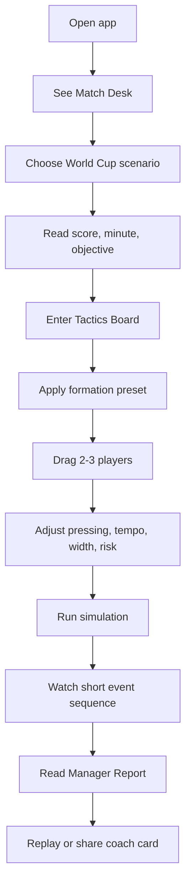
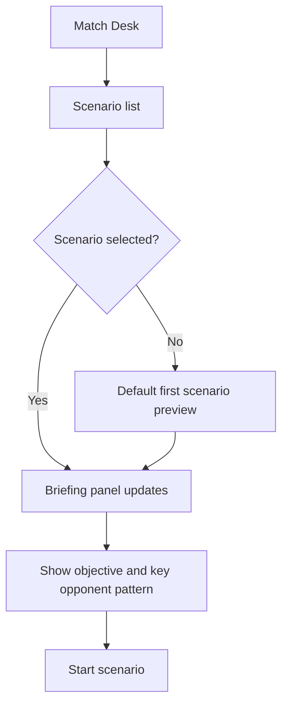
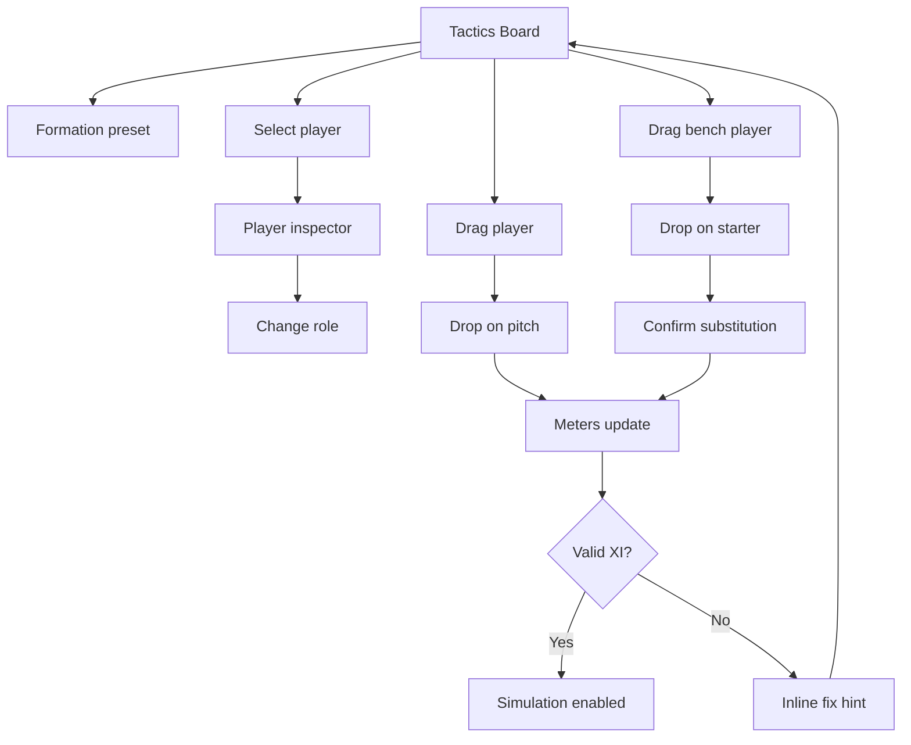
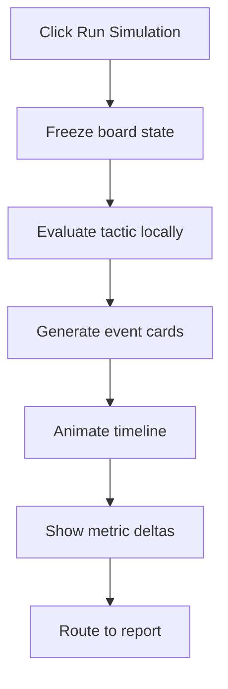
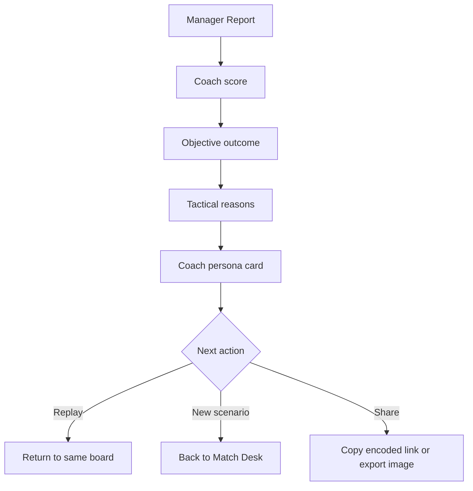
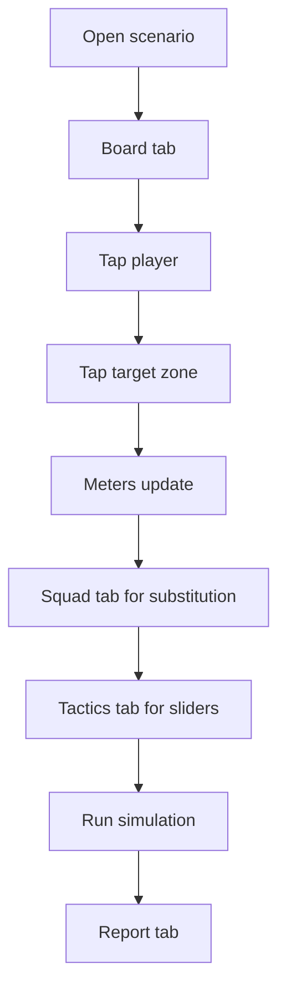
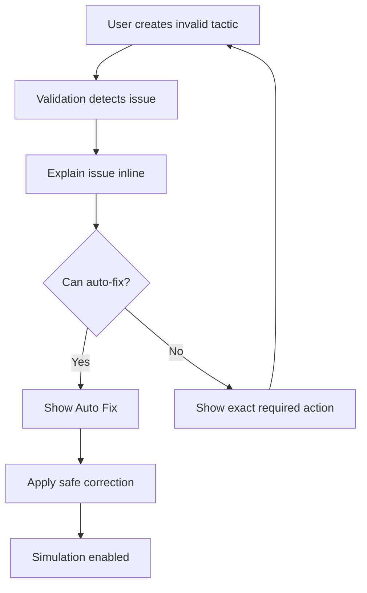
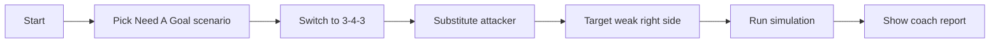

# User Flows - Touchline Replay 90

## 1. First-Time Happy Path

Design intent:
- The user should reach the board within one click.
- The first run should not require tactical knowledge.
- Presets and hints reduce blank-canvas anxiety.

## 2. Scenario Selection Flow

UX rules:
- Always preselect a recommended scenario.
- Use labels like "3분 추천", "공격형", "수비형".
- Avoid forcing users to compare too many options.

## 3. Tactical Editing Flow

UX rules:
- Show consequences immediately.
- Keep reset and auto-balance visible.
- Do not punish experimental formations too early.

## 4. Simulation Flow

UX rules:
- Simulation should be short and crisp.
- Always generate at least three readable events.
- Avoid black-box AI phrasing.

## 5. Report And Replay Flow

UX rules:
- Praise and critique should both be specific.
- Report should name the user's tactical identity.
- Replay should preserve previous choices so the user can iterate.

## 6. Mobile Flow

Mobile design rules:
- Board remains the first tab.
- Use tap-to-move as fallback for precise drag.
- Avoid tiny controls around the pitch.
- Keep simulation CTA sticky at the bottom.

## 7. Invalid State Recovery Flow

Example messages:
- "골키퍼가 빠졌습니다. 벤치에서 골키퍼를 올려주세요."
- "현재 12명이 필드에 있습니다. 한 명을 벤치로 내려주세요."
- "수비수가 2명뿐입니다. all-in 모드가 아니라면 최소 3명을 권장합니다."

## 8. Demo Flow For Submission Video

Recommended narration:
- "이 서비스는 단순한 전술판이 아니라, 실제 월드컵 경기의 결정적 순간을 감독으로 다시 플레이하는 웹 시뮬레이터입니다."
- "선수를 드래그하고 지시를 바꾸면 공격, 수비, 위험도가 즉시 변합니다."
- "결과 화면에서는 내가 왜 성공했는지, 어떤 위험을 감수했는지 설명해줍니다."

