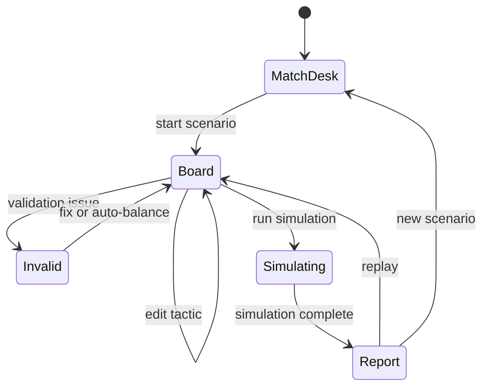

# Data And Architecture Plan - Touchline Replay 90

## 1. Data Strategy

The safest contest approach is static local data.

Primary data:
- OpenFootball worldcup.json for World Cup fixtures/results and match context.
- Self-authored scenario JSON for curated decision windows.
- Self-authored player JSON for squads, roles, ratings, and traits.

Why:
- No runtime API key.
- No judging dependency on external availability.
- Easier to make deterministic simulation and stable demo.

Licensing notes:
- OpenFootball worldcup.json states that schema, data, and scripts are public domain/CC0.
- Fjelstul World Cup Database is richer but CC-BY-SA 4.0, so use only if we clearly attribute and accept share-alike obligations.
- Avoid official logos, official player photos, broadcast clips, and unlicensed images.

## 2. Suggested Static Files

```text
src/data/
  worldcup/
    openfootball-2022-summary.json
    openfootball-2026-summary.json
  scenarios/
    scenarios.json
  squads/
    teams.json
    players.json
  tactics/
    formations.json
    role-definitions.json
```

## 3. Scenario JSON Shape

```json
{
  "id": "need-a-goal-67",
  "title": "Need A Goal",
  "year": 2022,
  "minute": 67,
  "score": [0, 1],
  "userTeamId": "team-kor",
  "opponentTeamId": "team-opp",
  "objective": {
    "type": "equalize",
    "label": "15분 안에 동점 루트를 만들어라",
    "weights": {
      "attack": 0.45,
      "defense": 0.2,
      "control": 0.25,
      "risk": 0.1
    }
  },
  "briefing": "상대 오른쪽 풀백의 체력이 떨어졌고, 중앙은 밀집되어 있다.",
  "opponentModel": {
    "dangerZones": ["left_half_space", "central_counter"],
    "weakZones": ["opponent_right_flank"],
    "pressResistance": 64,
    "counterThreat": 78
  }
}
```

## 4. Architecture

Recommended stack:
- Vite or Next.js with React and TypeScript.
- dnd-kit for drag/drop.
- Zustand for lightweight state.
- CSS modules or Tailwind, depending on project preference.
- Local JSON for data.
- Canvas or SVG for pitch overlays. SVG is easier for clickable zones; Canvas is better for animation. MVP can use SVG.

Suggested structure:

```text
src/
  app/
    routes/
    providers/
  components/
    layout/
    pitch/
    controls/
    report/
    common/
  data/
  domain/
    tactics/
      evaluateTactic.ts
      formationPresets.ts
      roleFit.ts
      validation.ts
    simulation/
      simulateScenario.ts
      generateReasons.ts
      coachPersona.ts
  features/
    match-desk/
    tactics-board/
    manager-report/
  stores/
    scenarioStore.ts
    tacticStore.ts
    simulationStore.ts
  styles/
  test/
```

## 5. Domain Modules

`evaluateTactic`
- Pure function.
- Input: scenario, player map, tactic state.
- Output: score breakdown and reason tags.

`validateTactic`
- Checks active XI, goalkeeper, duplicates, extreme formations.
- Returns blocking errors and soft warnings.

`formationPresets`
- Converts formation key into normalized pitch coordinates.
- Keeps role mapping explicit.

`generateReasons`
- Converts score details into Korean report text.
- Uses templates tied to reason tags.

`coachPersona`
- Maps score shape to persona.
- Example:
  - High attack, high risk: Chaos Chaser.
  - High defense, low risk: Balance Guardian.
  - High attack via flanks: Counter Punch Manager.

## 6. Tactics Evaluation Sketch

Inputs to calculate:
- Position fit: player preferred position vs current zone.
- Role fit: role requirements vs player stats.
- Spacing: distance between lines and lane coverage.
- Opponent targeting: user attack focus vs opponent weak zones.
- Defensive exposure: risk, pressing line, rest-defense player count.
- Fatigue fit: high press and fast tempo punish low stamina.

Example factors:

```text
attackScore =
  roleFitForAttack
  + weakZoneTargetBonus
  + widthTempoSynergy
  + creativePlayerCentrality
  - congestionPenalty

defenseScore =
  restDefenseCoverage
  + compactness
  + staminaSupport
  - highLineCounterPenalty
  - allInRiskPenalty

controlScore =
  midfieldTriangle
  + passingFit
  + tempoObjectiveFit
  - isolatedForwardPenalty

riskPenalty =
  counterExposure
  + tiredDefenderExposure
  + aggressiveInstructionStack
```

## 7. UI State Machine



## 8. Testing Plan

Unit tests:
- `validateTactic`
- `evaluateTactic`
- `formationPresets`
- `generateReasons`
- `coachPersona`

Integration tests:
- Scenario loads.
- Formation preset updates placements.
- Substitution updates active/bench lists.
- Simulation produces deterministic result.

Browser checks:
- Desktop board at 1440x900.
- Tablet board at 1024x768.
- Mobile tab flow at 390x844.
- No overlap in controls.
- Pitch remains usable.

## 9. Implementation Roadmap

Phase 1 - Skeleton
- App setup, routing, data files, base layout.

Phase 2 - Board
- Pitch SVG, player tokens, formation presets, local state.

Phase 3 - Interactions
- Drag/drop, tap-to-move, substitution, role inspector.

Phase 4 - Tactics engine
- Validation, scoring, reason generation.

Phase 5 - Report
- Simulation timeline, manager report, persona card.

Phase 6 - Polish
- Responsive tabs, accessibility, share/export, demo script.

## 10. Definition Of Done For Submission

- Deployed URL works without login.
- GitHub README has setup, tech stack, data attribution, and demo path.
- Demo video shows start screen, player placement, tactic setting, core interaction, result screen.
- No commits after 2026-08-03 10:00 if submitted.

