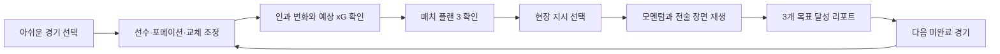

# Touchline Replay 90 V12: 레퍼런스 기반 대중성·재플레이 루프 고도화

## 1. 목표

V12의 목표는 기능을 더 많이 보여주는 것이 아니라, 축구를 잘 모르는 사용자도 다음 세 문장을 즉시 이해하게 만드는 것입니다.

1. 지금 무엇을 달성해야 하는가
2. 내가 바꾼 전술이 경기 흐름을 어떻게 바꿨는가
3. 한 경기가 끝난 뒤 왜 다음 경기를 다시 플레이하고 싶은가

대중 투표에서는 첫 30초의 이해도와 공유 욕구를, 내부 심사에서는 참신성·감독 몰입·동적 완성도·기획 일관성을 함께 노립니다.

## 2. 조사한 제품과 반영 원칙

### Football Manager 26

- 참고: [FM26 Match Day Experience](https://www.footballmanager.com/fm26/features/where-storytelling-evolves-fm26s-match-day-experience)
- 관찰: 경기 맥락에 따라 하이라이트 밀도를 바꾸고, 장면 사이에 2D 피치·xG·코치 조언을 제공해 다음 결정을 돕습니다.
- 반영: 6개의 의미 있는 장면만 남기고 각 장면을 `내 선택 → 생긴 공간 → 결과`로 설명합니다. 결과만 재생하지 않고 전술적 이유를 함께 노출합니다.

### Sofascore Attack Momentum

- 참고: [How Sofascore's Attack Momentum Changed Sport Analysis](https://www.sofascore.com/news/how-sofascores-attack-momentum-changed-sport-analysis)
- 관찰: 점유율이나 슈팅 숫자보다 양 팀의 공격 흐름을 위아래 그래프로 보여줄 때 비전문가도 경기의 주도권 변화를 빠르게 이해합니다.
- 반영: 누적 xG 변화, 장면 종류, 득점 여부를 이용해 6개 장면의 공격 강도를 계산하고 양 팀 방향으로 분리한 라이브 모멘텀을 제공합니다.

### StatsBomb 360

- 참고: [StatsBomb 360 Freeze Frame Viewer](https://statsbomb.com/news/statsbomb-360-freeze-frame-viewer-a-new-release-in-statsbomb-iq/)
- 관찰: 사건 하나만 보여주지 않고 그 순간 주변 선수 위치를 함께 보여주면 패스와 공간의 맥락을 해석하기 쉽습니다.
- 반영: 모든 리플레이 장면에 양 팀 22명, 공, 위험 구역, 전술 경로, 선택한 선수의 위치를 함께 표시합니다.

### Google DeepMind TacticAI

- 참고: [TacticAI: an AI assistant for football tactics](https://deepmind.google/blog/tacticai-ai-assistant-for-football-tactics/)
- 관찰: AI는 감독을 대체하는 자동 정답보다, 선수 위치를 바꿔보는 보조 제안과 비교 도구일 때 설득력이 높습니다.
- 반영: 코치 플랜은 원클릭 안전장치로 제공하지만 사용자가 언제든 배치·강도·교체를 다시 편집할 수 있습니다. 리포트도 `실제 경기 vs 내 선택 vs 코치 제안`을 나란히 비교합니다.

### EA SPORTS FC 26 Manager Live Challenges

- 참고: [FC 26 Career Mode Deep Dive](https://www.ea.com/games/ea-sports-fc/fc-26/news/pitch-notes-fc26-career-mode-deep-dive)
- 관찰: 실제 경기의 특정 시점에서 시작하고, 명확한 목표와 완료 화면을 제공하면 짧은 플레이도 하나의 완결된 도전이 됩니다.
- 반영: 각 월드컵 경기마다 결과·공격/수비 지표로 구성된 3개의 매치 플랜을 제공하고, 완료 수를 아카이브에 누적합니다.

### Football Manager 사용자 반응

- 참고: [FM UI 비교 토론](https://www.reddit.com/r/footballmanagergames/comments/1repe0a/after_fixes_and_time_to_settle_do_you_still_think/)
- 관찰: 정보가 같은 위계로 과밀하게 노출되고 메뉴가 중첩되면, 전술 자체가 좋아도 사용자가 길을 잃습니다.
- 반영: 이미 정보량이 충분한 전술 보드에는 패널을 추가하지 않았습니다. 새 정보는 시뮬레이션 준비·라이브·리포트의 기존 흐름 안에만 배치했습니다.

## 3. V12 핵심 기능

### 3.1 경기별 매치 플랜 3

모든 경기는 다음 세 조건을 갖습니다.

1. 결과 목표: 승리, 리드 유지, 연장 진입 등 실제 경기 맥락에 맞는 미션
2. 전술 정체성: 공격 폭, 후방 안정, 추진력 등 해당 경기의 핵심 축
3. 위험 관리: 상대 xG를 특정 기준 이하로 제한

시뮬레이션 전에는 세부 조건의 예상 충족 여부를 보여주되 최종 스코어는 숨깁니다. 사용자는 결과를 보기 전에 전술을 다시 조정할 수 있습니다.

### 3.2 라이브 공격 모멘텀

- 입력: 장면별 누적 내 xG·상대 xG, 공격 팀, 장면 종류
- 출력: 18~100 범위의 장면 강도
- 표현: 내 팀 공격은 기준선 위, 상대 공격은 기준선 아래
- 상호작용: 이미 열린 장면을 눌러 해당 시점으로 되감기
- 접근성: 각 장면은 분·장면 종류를 포함한 버튼 이름을 가집니다.

### 3.3 완료 수집과 다음 경기 루프

- 감독 리포트를 연 순간 현재 경기를 완료 처리합니다.
- 완료 상태는 브라우저에 저장되고 아카이브 카드에 표시됩니다.
- 리포트의 다음 경기 CTA는 현재 경기 이후 아직 완료하지 않은 경기를 우선 추천합니다.
- 모든 경기를 완료하면 카탈로그 순서로 순환합니다.

### 3.4 리포트의 설명력 강화

리포트 첫 화면에 매치 플랜 `n/3`과 실제 측정값을 노출합니다. 사용자는 단순한 승패가 아니라 다음을 확인합니다.

- 결과 목표를 달성했는가
- 공격 전술이 필요한 기대값을 만들었는가
- 공격을 늘린 대가로 상대 기회를 얼마나 허용했는가

## 4. 최종 사용자 흐름

## 5. 평가 기준 연결

| 평가 항목 | V12 설계 근거 |
| --- | --- |
| 참신성 30 | 실제 월드컵의 후회 지점을 `완료 가능한 감독 도전 컬렉션`으로 재구성 |
| 감독 경험 25 | 배치·교체·현장 지시가 장면, 모멘텀, xG, 결과에 연속 반영 |
| 완성도 25 | 결정론적 엔진, 자동 저장, 목표 판정, 다음 경기 추천, 24개 자동 테스트 |
| 기획/구현 20 | PRD의 핵심 문장인 `내가 바꾼 것이 왜 결과를 바꿨는가`를 모든 단계에 동일하게 적용 |

## 6. 시연 영상 권장 순서

1. 아카이브에서 실제 국기와 팬의 한마디를 5초간 보여줍니다.
2. 코치 플랜을 적용한 뒤 선수 한 명을 직접 이동합니다.
3. `내가 바꾼 것 → 공간 → 예상 결과`를 확대합니다.
4. 매치 플랜 3개를 확인하고 현장 지시를 선택합니다.
5. 라이브 모멘텀이 바뀌는 동안 득점 장면을 재생합니다.
6. 리포트의 3/3, 실제 경기 비교, 다음 경기 버튼을 보여줍니다.
7. 아카이브로 돌아가 첫 경기가 `완료`로 바뀐 장면으로 마무리합니다.

## 7. 검증 기준

- 1280×720 데스크톱 전체 흐름
- 390×844 모바일 아카이브·준비·라이브 흐름
- 브라우저 콘솔 오류 0건
- Node 테스트 24/24
- Vite 프로덕션 빌드 성공
- `npm audit` 취약점 0건

